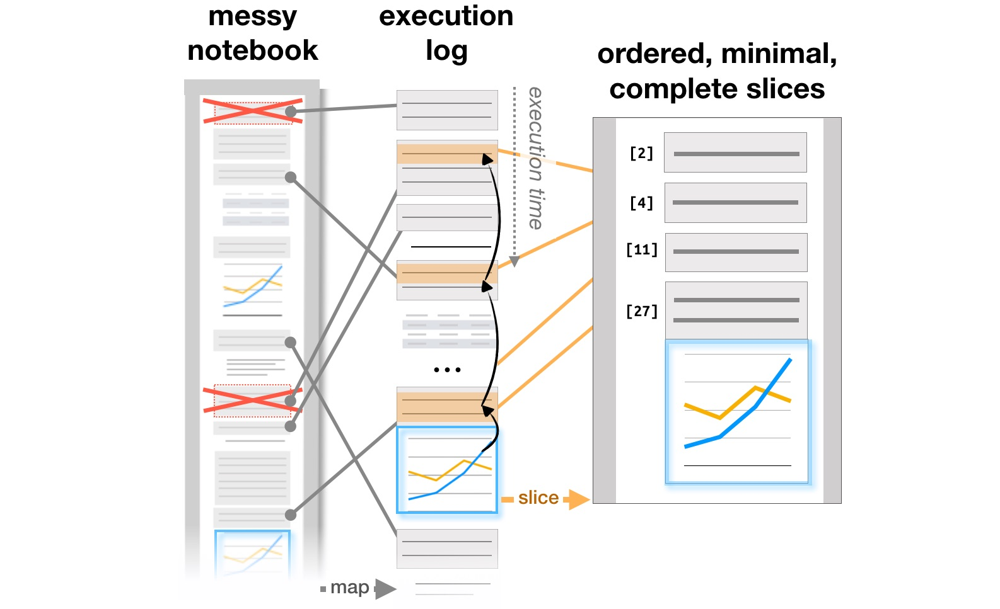

# Managing Messes in Computational Notebooks

Andrew Head, Fred Hohman, Titus Barik, Steven M. Drucker, and Robert DeLine

<b>Abstract</b>:
Data analysts use computational notebooks to write code for
analyzing and visualizing data. Notebooks help analysts
iteratively write analysis code by letting them interleave
code with output, and selectively execute cells. However, as
analysis progresses, analysts leave behind old code and
outputs, and overwrite important code, producing cluttered
and inconsistent notebooks. This paper introduces code
gathering tools, extensions to computational notebooks that
help analysts find, clean, recover, and compare versions of
code in cluttered, inconsistent notebooks. The tools archive
all versions of code outputs, allowing analysts to review
these versions and recover the subsets of code that produced
them. These subsets can serve as succinct summaries of
analysis activity or starting points for new analyses. In a
qualitative usability study, 12 professional analysts found
the tools useful for cleaning notebooks and writing analysis
code, and discovered new ways to use them, like generating
personal documentation and lightweight versioning.





If you want to try out out code gathering tools or view the
source code, check back soon. We will post the code and an
alpha version of the tools when we give the talk for the
paper on May 6, 2019.
